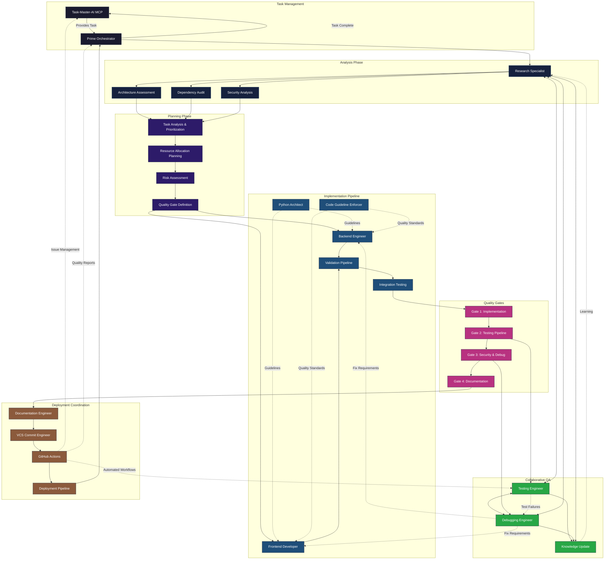
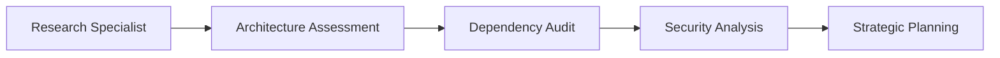
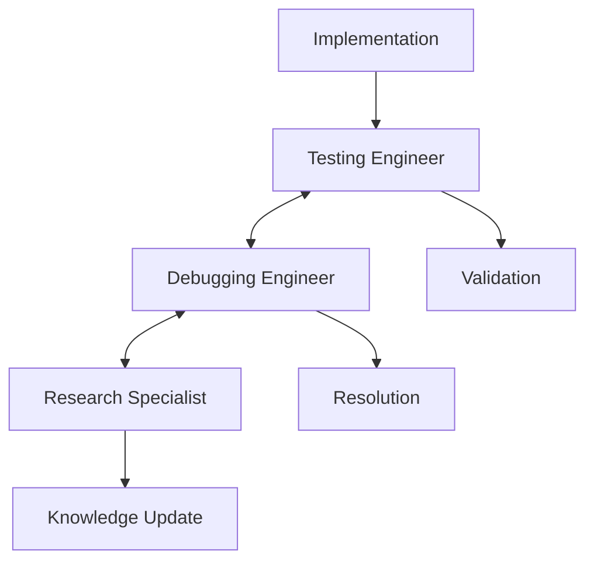
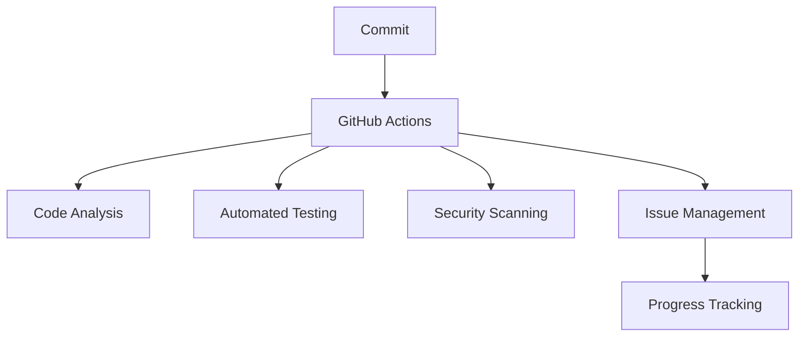

# Claude Sub-Agents System

A comprehensive orchestration system for AI-powered software development using specialized sub-agents with systematic workflows, automated GitHub Actions integration, and collaborative quality assurance.

## System Overview

The Claude Sub-Agents system creates a coordinated development ecosystem where specialized agents work together through systematic planning phases, quality gates, and automated GitHub integration. The Prime Orchestrator manages complex multi-phase workflows while ensuring quality and coordination at every step.

## Enhanced Agent Orchestration Flow



## Systematic Workflow Phases

### Phase 1: Task Reception & Analysis
- **Task-Master-AI Integration**: Automatic task retrieval and progress tracking
- **Comprehensive Analysis**: Research specialist conducts architecture assessment, dependency audit, and security analysis
- **Documentation Review**: PRD, architecture specs, and tech stack analysis

### Phase 2: Systematic Planning
- **Task Prioritization**: Break down complex tasks with dependency analysis
- **Resource Allocation**: Plan agent deployment sequence and coordination points
- **Risk Assessment**: Identify failure points and define contingency strategies
- **Quality Gate Definition**: Set mandatory checkpoints and success criteria

### Phase 3: Implementation Pipeline
- **Coordinated Development**: Backend and frontend engineers work with architectural guidance
- **Validation Pipeline**: Continuous validation and integration testing
- **Real-time Monitoring**: Progress tracking and proactive conflict resolution

### Phase 4: Quality Gate Enforcement
Sequential quality gates that must pass:
1. **Implementation Verification**: Feature completeness and pattern compliance
2. **Testing Pipeline**: Unit tests (>80% coverage), integration tests, performance benchmarks
3. **Security & Debugging**: Security scans, debugging verification, error handling
4. **Documentation & Standards**: Complete documentation, code review, architecture compliance

### Phase 5: Deployment Coordination
- **GitHub Actions Integration**: Automated workflows and issue lifecycle management
- **Version Control**: Structured commits with conventional messages
- **Continuous Integration**: Automated quality checks and deployment pipelines

## Agent Collaboration Patterns

### Research-Led Analysis Pattern


### Collaborative Quality Assurance


### GitHub Actions Integration


## Agent Descriptions

### 🎯 Prime Orchestrator
**Type**: `prime-orchestrator`  
**Enhanced Role**: Master coordinator with systematic workflow management  
**New Capabilities**:
- Systematic planning phases with risk assessment
- Quality gate enforcement and monitoring
- GitHub Actions coordination
- Real-time agent coordination and conflict resolution
- Continuous feedback loop management

### 🔍 Research Specialist
**Type**: `research-specialist`  
**Enhanced Role**: Collaborative research and analysis expert  
**New Capabilities**:
- Bidirectional integration with testing and debugging engineers
- Continuous knowledge base updates
- Security vulnerability research and pattern analysis
- Collaborative investigation protocols
- Proactive recommendations based on emerging patterns

### 🧪 Testing Engineer
**Type**: `testing-engineer`  
**Enhanced Role**: Integrated testing with collaborative debugging  
**New Capabilities**:
- Real-time collaboration with debugging engineer
- Research-backed testing strategies
- GitHub Actions test automation
- Quality gate integration
- Continuous test pattern analysis

### 🐛 Debugging Engineer
**Type**: `debugging-engineer`  
**Enhanced Role**: Systematic debugging with collaborative investigation  
**New Capabilities**:
- Joint investigation protocols with research specialist
- Bidirectional testing coordination
- VCS integration for commit-based debugging
- Knowledge sharing and pattern documentation
- Automated issue pattern detection

### 🔀 VCS Commit Engineer
**Type**: `vcs-commit-engineer`  
**Enhanced Role**: GitHub Actions integrated version control specialist  
**New Capabilities**:
- Automated GitHub workflow triggers
- Issue lifecycle management through commit messages
- Quality gate coordination
- Automated testing and documentation pipeline triggers
- Security scanning integration

### 💻 Backend Engineer
**Type**: `backend-engineer`  
**Role**: Server-side implementation with coordinated testing and debugging

### 🎨 Frontend Developer
**Type**: `frontend-developer`  
**Role**: UI/UX implementation with accessibility and performance focus

### 📝 Documentation Engineer
**Type**: `documentation-engineer`  
**Role**: Centralized documentation in `./docs/ai_docs/` with automated generation

### 🔧 DevOps Engineer
**Type**: `devops-engineer`  
**Role**: Nix-based environment management with CI/CD integration

### 🐍 Python Architect
**Type**: `python-architect`  
**Role**: Python-specific architectural guidance and best practices

### 📋 Code Guideline Enforcer
**Type**: `code-guideline-enforcer`  
**Role**: Code quality and standards enforcement

## Usage Examples

### Complex Feature Implementation
```python
<Task>
  <description>Implement user authentication with systematic workflow</description>
  <prompt>
    Implement JWT-based user authentication system.
    
    Requirements:
    - Registration and login endpoints
    - Token refresh mechanism
    - Role-based access control
    - Security best practices
    
    Documentation:
    - PRD: /docs/auth-requirements.md
    - Security guidelines: /docs/security-policy.md
    
    Use systematic workflow with all quality gates.
  </prompt>
  <subagent_type>prime-orchestrator</subagent_type>
</Task>
```

### Debugging with Collaborative Investigation
```python
<Task>
  <description>Debug authentication timeout with collaborative analysis</description>
  <prompt>
    Users experiencing unexpected logouts after 5 minutes.
    Started after recent deployment.
    
    Use collaborative debugging approach with research specialist
    and testing engineer to identify root cause and implement fix.
  </prompt>
  <subagent_type>debugging-engineer</subagent_type>
</Task>
```

## GitHub Actions Integration

### Automated Workflows
- **Commit Analysis**: Automatic code analysis on feature commits
- **Quality Gates**: Automated testing, security scanning, and documentation generation
- **Issue Management**: Automatic issue creation, tracking, and closure
- **Documentation**: Automated API documentation and changelog updates

### Issue Lifecycle Management
- Commit messages automatically manage GitHub issues
- Progress tracking through commit references
- Automated issue closure on fix verification
- Quality gate failure reporting

## Quality Assurance Features

### Sequential Quality Gates
1. Implementation verification and pattern compliance
2. Comprehensive testing with >80% coverage requirement
3. Security scanning and debugging verification
4. Documentation completeness and code review

### Collaborative Debugging
- Joint investigation between debugging and research engineers
- Shared knowledge base for common patterns
- Real-time communication during issue resolution
- Automated pattern detection and prevention

### Continuous Improvement
- Feedback loops between all agents
- Knowledge base updates from debugging discoveries
- Pattern analysis for proactive issue prevention
- Performance monitoring and optimization suggestions

## Best Practices

1. **Always Use Prime Orchestrator** for complex multi-component tasks
2. **Trust the Quality Gates** - systematic validation ensures reliability
3. **Leverage Collaborative Agents** - research, testing, and debugging work together
4. **Commit Message Standards** - use conventional commits for GitHub integration
5. **Documentation First** - comprehensive documentation drives development
6. **Security by Design** - security scanning at every quality gate

## System Requirements

- **Nix**: All environments managed through Nix flakes
- **direnv**: Automatic environment loading per branch
- **git**: Version control with worktree support for safe branching
- **GitHub**: Repository with Actions enabled for CI/CD integration
- **Task-Master-AI MCP**: Task management and progress tracking

## Future Enhancements

- **AI-Powered Code Review**: Automated code review with improvement suggestions
- **Performance Monitoring**: Real-time performance analysis and optimization
- **Security Intelligence**: Advanced threat detection and prevention
- **Multi-Language Architects**: Go, Rust, Java, and TypeScript specialists
- **Cross-Repository Coordination**: Multi-repo project management
