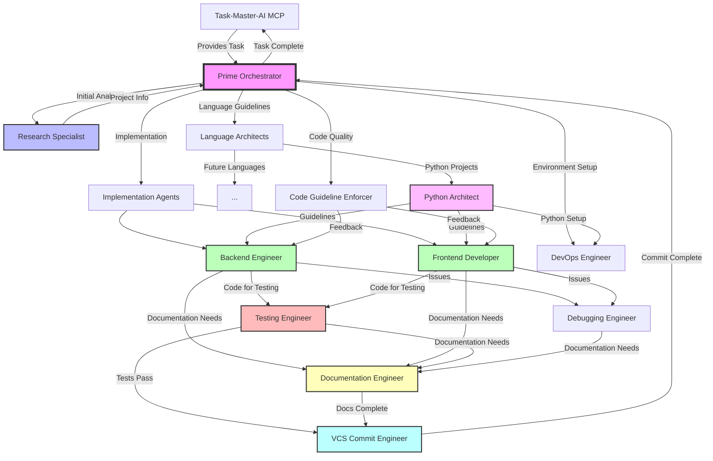

# Claude Sub-Agents System

A comprehensive orchestration system for AI-powered software development using specialized sub-agents. Each agent has a specific role and expertise, working together under the coordination of a prime orchestrator.

## System Overview

The Claude Sub-Agents system consists of specialized agents that handle different aspects of software development. The Prime Orchestrator coordinates these agents to complete complex tasks efficiently.

## Agent Orchestration Flow



## How to Use

### 1. Basic Usage

To use the sub-agents system, invoke the prime orchestrator with your task:

```python
<Task>
  <description>Orchestrate development task</description>
  <prompt>
    I need to implement a user authentication system.
    
    Documentation available:
    - PRD: /docs/auth-requirements.md
    - Architecture: /docs/system-architecture.md
    - Tech Stack: Python/FastAPI backend, React frontend
    
    Please coordinate the implementation.
  </prompt>
  <subagent_type>prime-orchestrator</subagent_type>
</Task>
```

### 2. Direct Agent Usage

You can also invoke specific agents directly for focused tasks:

```python
# For code quality checks
<Task>
  <description>Check code quality</description>
  <prompt>
    Review the /src directory for code quality issues
  </prompt>
  <subagent_type>code-guideline-enforcer</subagent_type>
</Task>

# For debugging
<Task>
  <description>Debug authentication issue</description>
  <prompt>
    Users are getting logged out after 5 minutes instead of 30 minutes.
    The issue started after yesterday's deployment.
  </prompt>
  <subagent_type>debugging-engineer</subagent_type>
</Task>
```

### 3. Integration with Task-Master-AI

The prime orchestrator automatically interfaces with task-master-ai MCP to:
- Retrieve tasks and subtasks
- Report progress
- Request clarifications
- Mark tasks as complete

## Agent Descriptions

### 🎯 Prime Orchestrator
**Type**: `prime-orchestrator`  
**Role**: Master coordinator that manages complex development tasks  
**Responsibilities**:
- Interfaces with task-master-ai MCP
- Analyzes project requirements
- Spawns and coordinates appropriate sub-agents
- Resolves conflicts between agents
- Ensures task completion and commits

### 🔍 Research Specialist
**Type**: `research-specialist`  
**Role**: Technical research and analysis expert  
**Responsibilities**:
- Analyzes codebase architecture
- Researches package documentation
- Investigates security vulnerabilities
- Provides technical recommendations
- Performs initial project analysis for orchestrator

### 💻 Backend Engineer
**Type**: `backend-engineer`  
**Role**: Server-side implementation specialist  
**Responsibilities**:
- Implements APIs and business logic
- Designs database schemas
- Integrates external services
- Follows language-specific guidelines
- Delegates testing and documentation

### 🎨 Frontend Developer
**Type**: `frontend-developer`  
**Role**: UI/UX implementation expert  
**Responsibilities**:
- Builds responsive user interfaces
- Implements component architectures
- Ensures accessibility standards
- Optimizes frontend performance
- Framework-agnostic implementation

### 🐍 Python Architect
**Type**: `python-architect`  
**Role**: Python-specific architectural guidance provider  
**Responsibilities**:
- Enforces Python project structure (src/ layout)
- Manages dependencies via uv/Nix integration
- Requires type annotations
- Provides best practices (does not implement)
- Ensures PEP compliance

### 🧪 Testing Engineer
**Type**: `testing-engineer`  
**Role**: Comprehensive testing specialist  
**Responsibilities**:
- Writes all tests (unit, integration, e2e)
- Manages test coverage (>80%)
- Runs tests before commits
- Handles all testing for all agents
- Stops work if tests fail

### 🐛 Debugging Engineer
**Type**: `debugging-engineer`  
**Role**: Systematic problem solver  
**Responsibilities**:
- Analyzes issues methodically
- Creates debugging plans before fixing
- Identifies root causes
- Implements fixes after thorough analysis
- Documents debugging process

### 📝 Documentation Engineer
**Type**: `documentation-engineer`  
**Role**: Centralized documentation specialist  
**Responsibilities**:
- Creates all documentation in `./docs/ai_docs/`
- Documents features, APIs, and architecture
- Collects AI session notes
- Maintains documentation organization
- Handles all documentation requests

### 🔧 DevOps Engineer
**Type**: `devops-engineer`  
**Role**: Nix-based environment and deployment specialist  
**Responsibilities**:
- Manages all dependencies through Nix
- Creates reproducible dev environments
- Handles CI/CD pipelines
- Maintains flake.nix structure
- Coordinates with language architects

### 📋 Code Guideline Enforcer
**Type**: `code-guideline-enforcer`  
**Role**: Code quality and standards enforcer  
**Responsibilities**:
- Analyzes code against guidelines
- Identifies anti-patterns
- Provides improvement suggestions
- Defers to language-specific rules
- Categorizes issues by severity

### 🔀 VCS Commit Engineer
**Type**: `vcs-commit-engineer`  
**Role**: Version control specialist  
**Responsibilities**:
- Creates meaningful commits
- Works only on feature branches
- Scans for security issues
- Never commits to main/master
- Ensures atomic, logical commits

## Coordination Patterns

### Sequential Pattern
Used for dependent tasks:
```
Research → Architecture → Implementation → Testing → Documentation → Commit
```

### Parallel Pattern
Used for independent tasks:
```
Backend Implementation ─┐
                       ├─→ Testing → Documentation → Commit
Frontend Implementation ┘
```

### Advisory Pattern
Language architects provide guidance:
```
Python Architect ─┐
                  ├─→ Backend Engineer → Testing
Code Guidelines ──┘
```

## Best Practices

1. **Always Start with Prime Orchestrator** for complex tasks
2. **Provide Clear Documentation** - Include PRDs, architecture docs, and requirements
3. **Let Agents Delegate** - Don't manually coordinate between agents
4. **Trust the Process** - Agents will ensure quality through their workflows
5. **Ask for Clarification** - Orchestrator will ask if requirements are unclear

## Common Workflows

### New Feature Implementation
1. Prime Orchestrator receives task from task-master-ai
2. Research Specialist analyzes codebase
3. Language architects provide guidelines
4. Implementation agents build feature
5. Testing Engineer validates
6. Documentation Engineer documents
7. VCS Commit Engineer commits

### Bug Fix
1. Debugging Engineer investigates issue
2. Creates fix plan
3. Implementation agent applies fix
4. Testing Engineer verifies
5. VCS Commit Engineer commits

### Code Quality Review
1. Code Guideline Enforcer analyzes code
2. Provides categorized issues
3. Implementation agents address issues
4. Testing Engineer validates changes
5. VCS Commit Engineer commits improvements

## System Requirements

- **Nix**: All environments managed through Nix
- **direnv**: For automatic environment loading
- **git**: Version control with worktree support
- **Task-Master-AI MCP**: For task management integration

## Future Enhancements

- Additional language architects (Go, Rust, Java)
- Security-focused agent
- Performance optimization agent
- Database specialist agent
- AI model integration agent